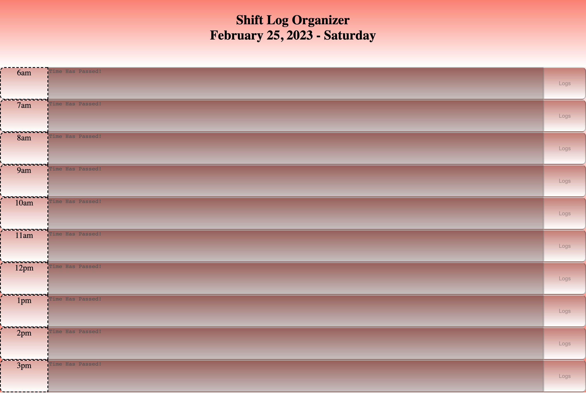
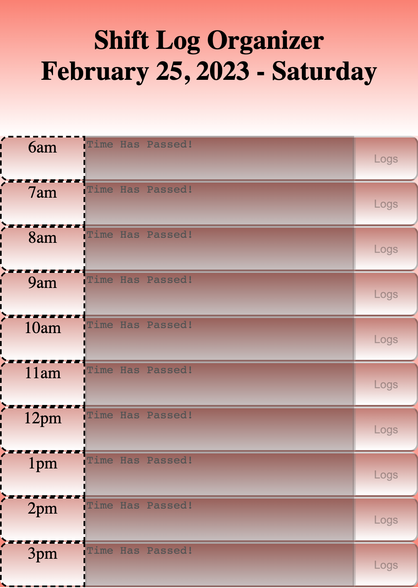

# Schedule Organizer

## Usage
Being organize is a part of our everyday life. This apps help everyday user especially those works a 40 hours a week job. This helps user organize daily acitivities, like zoom meetings, etc base on times. 

## Description
This app includes a title, current dates that changes each day. Each event blocks represents every hours. it will pick up current hour and highlight the block to let user know that it is that time. It will also let user know if the time has passed and the block(s) and the corresponding buttons will be disabled and will not be able to edit.

## URL
https://jayp308.github.io/schedule-organizer/

## Screenshots
Desktop View

Sample Phone View

## Credits
Junnel R. Padilla, UC Berkeley Bootcamp Modules, Stackoverflow, Google

## License

MIT License

Copyright (c) 2023 JayP

Permission is hereby granted, free of charge, to any person obtaining a copy
of this software and associated documentation files (the "Software"), to deal
in the Software without restriction, including without limitation the rights
to use, copy, modify, merge, publish, distribute, sublicense, and/or sell
copies of the Software, and to permit persons to whom the Software is
furnished to do so, subject to the following conditions:

The above copyright notice and this permission notice shall be included in all
copies or substantial portions of the Software.

THE SOFTWARE IS PROVIDED "AS IS", WITHOUT WARRANTY OF ANY KIND, EXPRESS OR
IMPLIED, INCLUDING BUT NOT LIMITED TO THE WARRANTIES OF MERCHANTABILITY,
FITNESS FOR A PARTICULAR PURPOSE AND NONINFRINGEMENT. IN NO EVENT SHALL THE
AUTHORS OR COPYRIGHT HOLDERS BE LIABLE FOR ANY CLAIM, DAMAGES OR OTHER
LIABILITY, WHETHER IN AN ACTION OF CONTRACT, TORT OR OTHERWISE, ARISING FROM,
OUT OF OR IN CONNECTION WITH THE SOFTWARE OR THE USE OR OTHER DEALINGS IN THE
SOFTWARE.
